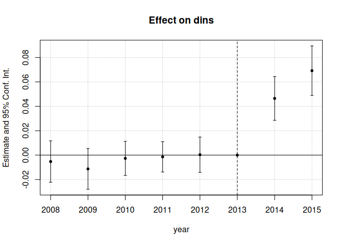
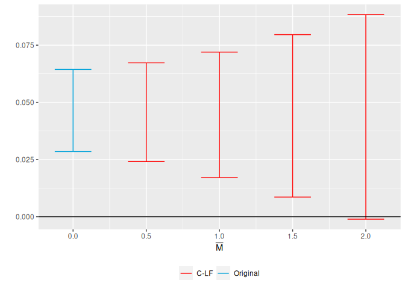
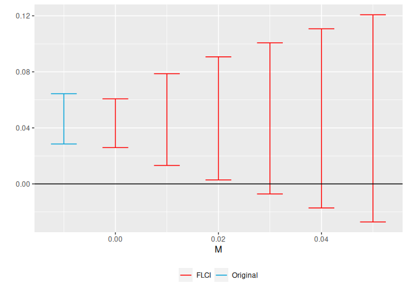
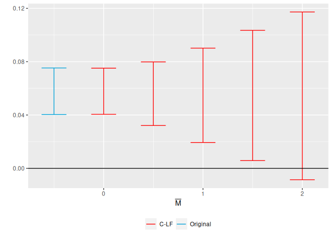
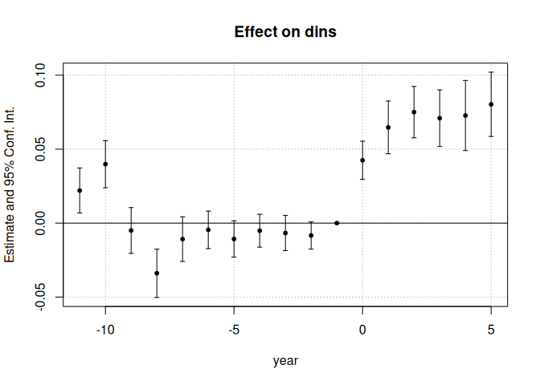

HonestDiD
================

The HonestDiD R package implements the tools for robust inference and
sensitivity analysis for differences-in-differences and event study
designs developed in [Rambachan and Roth
(2022)](https://asheshrambachan.github.io/assets/files/hpt-draft.pdf).
There is also an [HonestDiD Stata
package](https://github.com/mcaceresb/stata-honestdid#honestdid), and a
[Shiny app](https://ccfang2.shinyapps.io/HonestDiDSenAnlys/) developed
by Chengcheng Fang.

## Background

The robust inference approach in Rambachan and Roth formalizes the
intuition that pre-trends are informative about violations of parallel
trends. They provide a few different ways of formalizing what this
means.

**Bounds on relative magnitudes.** One way of formalizing this idea is
to say that the violations of parallel trends in the post-treatment
period cannot be much bigger than those in the pre-treatment period.
This can be formalized by imposing that the post-treatment violation of
parallel trends is no more than some constant

larger than the maximum violation of parallel trends in the
pre-treatment period. The value of

= 1, for instance, imposes that the post-treatment violation of parallel
trends is no longer than the worst pre-treatment violation of parallel
trends (between consecutive periods). Likewise, setting

= 2 implies that the post-treatment violation of parallel trends is no
more than twice that in the pre-treatment period.

**Smoothness restrictions.** A second way of formalizing this is to say
that the post-treatment violations of parallel trends cannot deviate too
much from a linear extrapolation of the pre-trend. In particular, we can
impose that the slope of the pre-trend can change by no more than *M*
across consecutive periods, as shown in the figure below for an example
with three periods.

<figure>

<figcaption
aria-hidden="true">diagram-smoothness-restriction</figcaption>
</figure>

Thus, imposing a smoothness restriction with *M* = 0 implies that the
counterfactual difference in trends is exactly linear, whereas larger
values of *M* allow for more non-linearity.

**Other restrictions**. The Rambachan and Roth framework allows for a
variety of other restrictions on the differences in trends as well. For
example, the smoothness restrictions and relative magnitudes ideas can
be combined to impose that the non-linearity in the post-treatment
period is no more than

times larger than that in the pre-treatment periods. The researcher can
also impose monotonicity or sign restrictions on the differences in
trends as well.

**Robust confidence intervals**. Given restrictions of the type
described above, Rambachan and Roth provide methods for creating robust
confidence intervals that are guaranteed to include the true parameter
at least 95% of the time when the imposed restrictions on satisfied.
These confidence intervals account for the fact that there is estimation
error both in the treatment effects estimates and our estimates of the
pre-trends.

**Sensitivity analysis**. The approach described above naturally lends
itself to sensitivity analysis. That is, the researcher can report
confidence intervals under different assumptions about how bad the
post-treatment violation of parallel trends can be (e.g., different
values of

or *M*.) They can also report the “breakdown value” of

(or *M*) for a particular conclusion – e.g. the largest value of

for which the effect is still significant.

## Package installation

The package may be installed by using the function `install_github()`
from the `remotes` package:

``` r
## Installation

# Install remotes package if not installed
install.packages("remotes") 

# Turn off warning-error-conversion, because the tiniest warning stops installation
Sys.setenv("R_REMOTES_NO_ERRORS_FROM_WARNINGS" = "true")

# install from github
remotes::install_github("asheshrambachan/HonestDiD")
```

## Example usage – Medicaid expansions

As an illustration of the package, we will examine the effects of
Medicaid expansions on insurance coverage using publicly-available data
derived from the ACS. We first load the data and packages relevant for
the analysis.

``` r
#Install here, dplyr, did, haven, ggplot2, fixest packages from CRAN if not yet installed
#install.packages(c("here", "dplyr", "did", "haven", "ggplot2", "fixest"))

library(here)
library(dplyr)
library(did)
library(haven)
library(ggplot2)
library(fixest)
library(HonestDiD)

df <- read_dta("https://raw.githubusercontent.com/Mixtape-Sessions/Advanced-DID/main/Exercises/Data/ehec_data.dta")
head(df,5)
```

    ## # A tibble: 5 × 5
    ##   stfips      year         dins yexp2      W
    ##   <dbl+lbl>   <dbl+lbl>   <dbl> <dbl>  <dbl>
    ## 1 1 [alabama] 2008 [2008] 0.681    NA 613156
    ## 2 1 [alabama] 2009 [2009] 0.658    NA 613156
    ## 3 1 [alabama] 2010 [2010] 0.631    NA 613156
    ## 4 1 [alabama] 2011 [2011] 0.656    NA 613156
    ## 5 1 [alabama] 2012 [2012] 0.671    NA 613156

The data is a state-level panel with information on health insurance
coverage and Medicaid expansion. The variable `dins` shows the share of
low-income childless adults with health insurance in the state. The
variable `yexp2` gives the year that a state expanded Medicaid coverage
under the Affordable Care Act, and is missing if the state never
expanded.

### Estimate the baseline DiD

For simplicity, we will first focus on assessing sensitivity to
violations of parallel trends in a non-staggered DiD (see below
regarding methods for staggered timing). We therefore restrict the
sample to the years 2015 and earlier, and drop the small number of
states who are first treated in 2015. We are now left with a panel
dataset where some units are first treated in 2014 and the remaining
units are not treated during the sample period. We can then estimate the
effects of Medicaid expansion using a canonical two-way fixed effects
event-study specification,


where D is 1 if a unit is first treated in 2014 and 0 otherwise.

``` r
df <- read_dta("https://raw.githubusercontent.com/Mixtape-Sessions/Advanced-DID/main/Exercises/Data/ehec_data.dta")

#Keep years before 2016. Drop the 2016 cohort
df_nonstaggered <- df %>% filter(year < 2016 & 
                                 (is.na(yexp2)| yexp2 != 2015) )

#Create a treatment dummy
df_nonstaggered <- df_nonstaggered %>% mutate(D = case_when( yexp2 == 2014 ~ 1,
                                                             T ~ 0)) 

#Run the TWFE spec
twfe_results <- fixest::feols(dins ~ i(year, D, ref = 2013) | stfips + year, 
                        cluster = "stfips",
                        data = df_nonstaggered)


betahat <- summary(twfe_results)$coefficients #save the coefficients
sigma <- summary(twfe_results)$cov.scaled #save the covariance matrix


fixest::iplot(twfe_results)
```

<!-- -->

## Sensitivity analysis using relative magnitudes restrictions

We are now ready to apply the HonestDiD package to do sensitivity
analysis. Suppose we’re interested in assessing the sensitivity of the
estimate for 2014, the first year after treatment.

``` r
delta_rm_results <- 
HonestDiD::createSensitivityResults_relativeMagnitudes(
                                    betahat = betahat, #coefficients
                                    sigma = sigma, #covariance matrix
                                    numPrePeriods = 5, #num. of pre-treatment coefs
                                    numPostPeriods = 2, #num. of post-treatment coefs
                                    Mbarvec = seq(0.5,2,by=0.5) #values of Mbar
                                    )

delta_rm_results
```

    ## # A tibble: 4 × 5
    ##          lb     ub method Delta    Mbar
    ##       <dbl>  <dbl> <chr>  <chr>   <dbl>
    ## 1  0.0240   0.0672 C-LF   DeltaRM   0.5
    ## 2  0.0170   0.0720 C-LF   DeltaRM   1  
    ## 3  0.00824  0.0797 C-LF   DeltaRM   1.5
    ## 4 -0.000916 0.0881 C-LF   DeltaRM   2

The output of the previous command shows a robust confidence interval
for different values of
.
We see that the “breakdown value” for a significant effect is

= 2, meaning that the significant result is robust to allowing for
violations of parallel trends up to twice as big as the max violation in
the pre-treatment period.

We can also visualize the sensitivity analysis using the
`createSensitivityPlot_relativeMagnitudes`. To do this, we first have to
calculate the CI for the original OLS estimates using the
`constructOriginalCS` command. We then pass our sensitivity analysis and
the original results to the `createSensitivityPlot_relativeMagnitudes`
command.

``` r
originalResults <- HonestDiD::constructOriginalCS(betahat = betahat,
                                                  sigma = sigma,
                                                  numPrePeriods = 5,
                                                  numPostPeriods = 2)

HonestDiD::createSensitivityPlot_relativeMagnitudes(delta_rm_results, originalResults)
```

<!-- -->

## Sensitivity Analysis Using Smoothness Restrictions

We can also do a sensitivity analysis based on smoothness restrictions –
i.e. imposing that the slope of the difference in trends changes by no
more than *M* between periods.

``` r
delta_sd_results <- 
  HonestDiD::createSensitivityResults(betahat = betahat,
                                      sigma = sigma,
                                      numPrePeriods = 5,
                                      numPostPeriods = 2,
                                      Mvec = seq(from = 0, to = 0.05, by =0.01))

delta_sd_results
```

    ## # A tibble: 6 × 5
    ##         lb     ub method Delta       M
    ##      <dbl>  <dbl> <chr>  <chr>   <dbl>
    ## 1  0.0259  0.0607 FLCI   DeltaSD  0   
    ## 2  0.0132  0.0787 FLCI   DeltaSD  0.01
    ## 3  0.00286 0.0907 FLCI   DeltaSD  0.02
    ## 4 -0.00714 0.101  FLCI   DeltaSD  0.03
    ## 5 -0.0171  0.111  FLCI   DeltaSD  0.04
    ## 6 -0.0271  0.121  FLCI   DeltaSD  0.05

``` r
createSensitivityPlot(delta_sd_results, originalResults)
```

<!-- -->

We see that the breakdown value for a significant effect is *M* ≈ 0.03,
meaning that we can reject a null effect unless we are willing to allow
for the linear extrapolation across consecutive periods to be off by
more than 0.03 percentage points.

## Sensitivity Analysis for Average Effects or Other Periods

So far we have focused on the effect for the first post-treatment
period, which is the default in HonestDiD. If we are instead interested
in the average over the two post-treatment periods, we can use the
option `l_vec = c(0.5,0.5)`. More generally, the package accommodates
inference on any scalar parameter of the form
*θ* = *l*<sub>*v**e**c*</sub>′*τ*<sub>*p**o**s**t*</sub>, where
*τ*<sub>*p**o**s**t*</sub> = (*τ*<sub>1</sub>,…,*τ*<sub>*T̄*</sub>)′ is
the vector of dynamic treatment effects. Thus, for example, setting
`l_vec = basisVector(2,numPostPeriods)` allows us to do inference on the
effect for the second period after treatment.

``` r
delta_rm_results_avg <- 
HonestDiD::createSensitivityResults_relativeMagnitudes(betahat = betahat,
                                    sigma = sigma,
                                    numPrePeriods = 5,
                                    numPostPeriods = 2, Mbarvec = seq(0,2,by=0.5),
                                    l_vec = c(0.5,0.5))

originalResults_avg <- HonestDiD::constructOriginalCS(betahat = betahat,
                                                  sigma = sigma,
                                                  numPrePeriods = 5,
                                                  numPostPeriods = 2,
                                                  l_vec = c(0.5,0.5))

HonestDiD::createSensitivityPlot_relativeMagnitudes(delta_rm_results_avg, originalResults_avg)
```

<!-- -->

## Regressions with controls

The parameters `betahat` and `sigma` should be the coefficients and
variance-covariance matrix for the **event-study** plot only. Sometimes
we may have regression results that contain both the event-study
coefficients and coefficients on other auxilliary variables
(e.g. controls). In this case, we should subset `betahat` and `sigma` to
the relevant coefficients corresponding to the event-study. An example
is given below:

``` r
# CREATE A FAKE CONTROL FOR ILLUSTRATION
set.seed(0)
df_nonstaggered$control <- rnorm(NROW(df_nonstaggered), 0, 1)

#Run the TWFE spec with the control added
# (Note that TWFEs with controls may not yield ATT under het effects; see Abadie 2005)
twfe_results <- fixest::feols(dins ~ i(year, D, ref = 2013) + control | stfips + year, 
                              cluster = "stfips",
                              data = df_nonstaggered)


betahat <- summary(twfe_results)$coefficients #save the coefficients
sigma <- summary(twfe_results)$cov.scaled #save the covariance matrix

#Subset the coefficients to exclude the control, which here is in position 8
betahat <- betahat[-8]
sigma <-sigma[-8,-8]

HonestDiD::createSensitivityResults(betahat = betahat,
                                    sigma = sigma,
                                    numPrePeriods = 5,
                                    numPostPeriods = 2,
                                    Mvec = seq(from = 0, to = 0.05, by =0.01))
```

    ## # A tibble: 6 × 5
    ##         lb     ub method Delta       M
    ##      <dbl>  <dbl> <chr>  <chr>   <dbl>
    ## 1  0.0264  0.0607 FLCI   DeltaSD  0   
    ## 2  0.0128  0.0788 FLCI   DeltaSD  0.01
    ## 3  0.00186 0.0908 FLCI   DeltaSD  0.02
    ## 4 -0.00814 0.101  FLCI   DeltaSD  0.03
    ## 5 -0.0181  0.111  FLCI   DeltaSD  0.04
    ## 6 -0.0281  0.121  FLCI   DeltaSD  0.05

## Staggered timing

So far we have focused on a simple case without staggered timing.
Fortunately, the HonestDiD approach works well with recently-introduced
methods for DiD under staggered treatment timing. Below, we show how the
package can be used with the [did
package](https://github.com/bcallaway11/did#difference-in-differences-)
implementing Callaway and Sant’Anna. (See, also, the example on the did
package [website](https://github.com/pedrohcgs/CS_RR)). We are hoping to
more formally integrate the did and HonestDiD packages in the future –
stay tuned!

First, we import the function Pedro Sant’Anna created for formatting did
output for HonestDiD:

``` r
#' @title honest_did
#'
#' @description a function to compute a sensitivity analysis
#'  using the approach of Rambachan and Roth (2021)
honest_did <- function(...) UseMethod("honest_did")

#' @title honest_did.AGGTEobj
#'
#' @description a function to compute a sensitivity analysis
#'  using the approach of Rambachan and Roth (2021) when
#'  the event study is estimating using the `did` package
#'
#' @param e event time to compute the sensitivity analysis for.
#'  The default value is `e=0` corresponding to the "on impact"
#'  effect of participating in the treatment.
#' @param type Options are "smoothness" (which conducts a
#'  sensitivity analysis allowing for violations of linear trends
#'  in pre-treatment periods) or "relative_magnitude" (which
#'  conducts a sensitivity analysis based on the relative magnitudes
#'  of deviations from parallel trends in pre-treatment periods).
#' @inheritParams HonestDiD::createSensitivityResults
#' @inheritParams HonestDid::createSensitivityResults_relativeMagnitudes
honest_did.AGGTEobj <- function(es,
                                e          = 0,
                                type       = c("smoothness", "relative_magnitude"),
                                gridPoints = 100,
                                ...) {

  type <- match.arg(type)

  # Make sure that user is passing in an event study
  if (es$type != "dynamic") {
    stop("need to pass in an event study")
  }

  # Check if used universal base period and warn otherwise
  if (es$DIDparams$base_period != "universal") {
    stop("Use a universal base period for honest_did")
  }

  # Recover influence function for event study estimates
  es_inf_func <- es$inf.function$dynamic.inf.func.e

  # Recover variance-covariance matrix
  n <- nrow(es_inf_func)
  V <- t(es_inf_func) %*% es_inf_func / n / n

  # Check time vector is consecutive with referencePeriod = -1
  referencePeriod <- -1
  consecutivePre  <- !all(diff(es$egt[es$egt <= referencePeriod]) == 1)
  consecutivePost <- !all(diff(es$egt[es$egt >= referencePeriod]) == 1)
  if ( consecutivePre | consecutivePost ) {
    msg <- "honest_did expects a time vector with consecutive time periods;"
    msg <- paste(msg, "please re-code your event study and interpret the results accordingly.", sep="\n")
    stop(msg)
  }

  # Remove the coefficient normalized to zero
  hasReference <- any(es$egt == referencePeriod)
  if ( hasReference ) {
    referencePeriodIndex <- which(es$egt == referencePeriod)
    V    <- V[-referencePeriodIndex,-referencePeriodIndex]
    beta <- es$att.egt[-referencePeriodIndex]
  } else {
    beta <- es$att.egt
  }

  nperiods <- nrow(V)
  npre     <- sum(1*(es$egt < referencePeriod))
  npost    <- nperiods - npre
  if ( !hasReference & (min(c(npost, npre)) <= 0) ) {
    if ( npost <= 0 ) {
      msg <- "not enough post-periods "
    } else {
      msg <- "not enough pre-periods "
    }
    msg <- paste0(msg, " (is your time vector is coded to have -1 as the reference?)")
    stop(msg)
  }

  baseVec1 <- basisVector(index=(e+1),size=npost)
  orig_ci  <- constructOriginalCS(betahat        = beta,
                                  sigma          = V,
                                  numPrePeriods  = npre,
                                  numPostPeriods = npost,
                                  l_vec          = baseVec1)

  if (type=="relative_magnitude") {
    robust_ci <- createSensitivityResults_relativeMagnitudes(betahat        = beta,
                                                             sigma          = V,
                                                             numPrePeriods  = npre,
                                                             numPostPeriods = npost,
                                                             l_vec          = baseVec1,
                                                             gridPoints     = gridPoints,
                                                             ...)

  } else if (type == "smoothness") {
    robust_ci <- createSensitivityResults(betahat        = beta,
                                          sigma          = V,
                                          numPrePeriods  = npre,
                                          numPostPeriods = npost,
                                          l_vec          = baseVec1,
                                          ...)
  }

  return(list(robust_ci=robust_ci, orig_ci=orig_ci, type=type))
}
```

``` r
###
# Run the CS event-study with 'universal' base-period option
## Note that universal base period normalizes the event-time minus 1 coef to 0
cs_results <- did::att_gt(yname = "dins",
                          tname = "year",
                          idname = "stfips", 
                          gname = "yexp2", 
                          data = df %>% mutate(yexp2 = ifelse(is.na(yexp2), 3000, yexp2)),
                          control_group = "notyettreated",
                          base_period = "universal")

es <- did::aggte(cs_results, type = "dynamic", 
                 min_e = -5, max_e = 5)

#Run sensitivity analysis for relative magnitudes 
sensitivity_results <-
  honest_did(es,
             e=0,
             type="relative_magnitude",
             Mbarvec=seq(from = 0.5, to = 2, by = 0.5))

HonestDiD::createSensitivityPlot_relativeMagnitudes(sensitivity_results$robust_ci,
                                                    sensitivity_results$orig_ci)
```

<!-- -->

## Additional options and resources

See the previous package \[vignette\] for additional examples and
package options, including incorporating sign and monotonicity
restrictions, and combining relative magnitudes and smoothness
restrictions.

You can also view a video presentation about this paper
[here](https://www.youtube.com/watch?v=6-NkiA2jN7U).

## Authors

- [Ashesh Rambachan](https://asheshrambachan.github.io/)

- [Jonathan Roth](https://www.jonathandroth.com/)

## Acknowledgements

This software package is based upon work supported by the National
Science Foundation Graduate Research Fellowship under Grant DGE1745303
(Rambachan) and Grant DGE1144152 (Roth). We thank [Mauricio Cáceres
Bravo](https://mcaceresb.github.io/) for his help in developing the
package.
